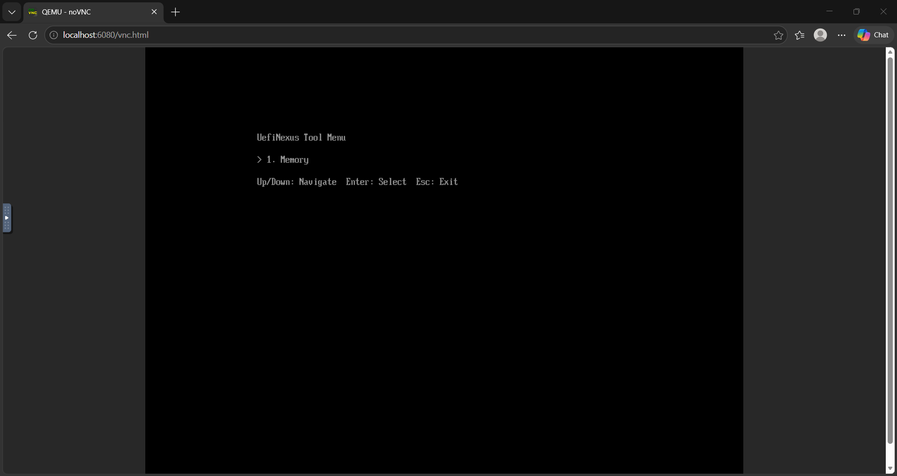
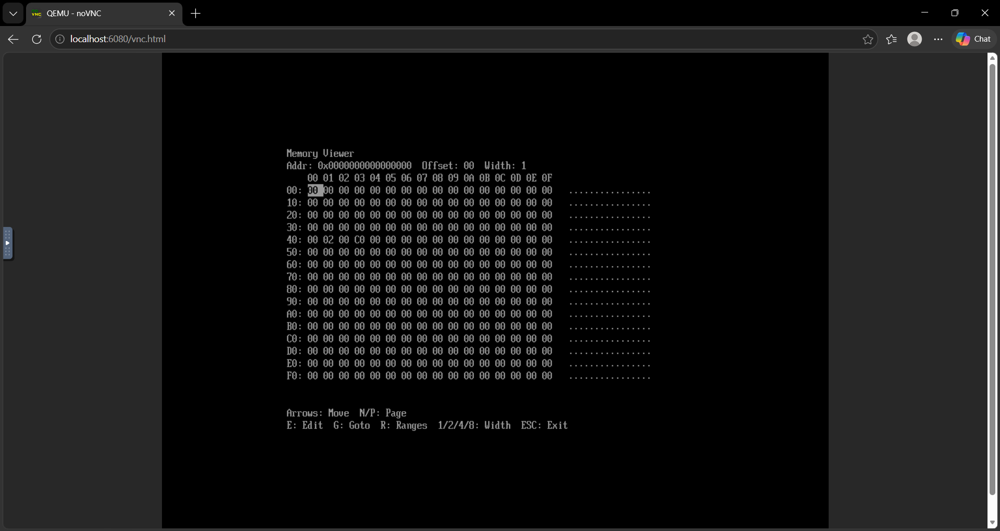

# UefiNexus

UefiNexus is a technical research platform focused on UEFI framework architecture, platform diagnostics, and reusable diagnostic applications.

Rather than targeting a single diagnostic scenario, the project explores how platform diagnostic applications can be structured for maintainability, extensibility, and effective testing within UEFI environments.

Technologies:

- UEFI
- EDK II
- C
- QEMU

## Screenshots

### Main Menu

The framework provides a menu-driven interface for launching diagnostic pages.

### Memory Viewer

The current reference implementation provides interactive memory inspection, navigation, and editing capabilities.

## Research Focus

Research areas include:

- Modular UEFI application architecture
- Platform diagnostics
- Extensible diagnostic frameworks
- Diagnostic software testability

The current implementation includes a Memory diagnostic page (PageMem), which serves as the primary reference implementation for framework experimentation and evolution.

## Project Vision

UefiNexus is intended to evolve into a reusable platform diagnostics framework capable of hosting multiple diagnostic modules under a common architecture and user interface.

Potential diagnostic modules supported by the framework include:

- Memory Viewer
- PCIe Device Viewer
- ACPI Table Viewer
- SMBIOS Viewer
- CPU Topology Viewer

Future development will focus on framework extensibility, diagnostic module expansion, and continued improvements to testing and maintainability.

## Documentation

Additional documentation is available in the `docs` directory:

| Document | Description |
|-----------|-------------|
| [architecture.md](docs/architecture.md) | Framework architecture and design rationale |
| [build.md](docs/build.md) | Build and execution instructions |
| [extension-guide.md](docs/extension-guide.md) | Adding and organizing diagnostic modules |
| [testing.md](docs/testing.md) | Testing strategy and validation workflows |
| [copilot-pr-flow.md](docs/copilot-pr-flow.md) | Contribution workflow and AI-assisted development guidelines |
