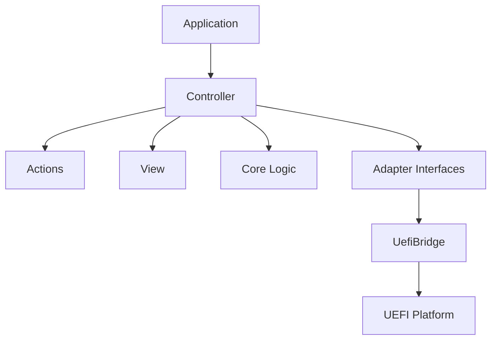

# UefiNexus

UefiNexus is a practical UEFI application framework for building diagnostic tools with a layered, testable architecture. It separates page logic from UEFI-specific implementation details, making features easier to develop, test, and maintain.

The current implementation includes a memory diagnostic application that demonstrates the framework architecture in practice. The same architecture can be used to build additional diagnostic tools with a consistent development model.

---

## Architecture Diagram



---

## Architecture at a Glance

| Layer | Responsibility |
|---------|----------------------------|
| Controller | Coordinates page workflow and input handling |
| Core | Pure page logic and page state management (no UEFI dependency) |
| View | Screen rendering |
| Actions | Execute user commands |
| Adapter | Abstract access to UEFI services |
 
## Why this architecture matters
 
- Core logic can be tested on the host without a UEFI environment
- Mock adapters can be used to validate page behavior
- UEFI-specific code remains isolated behind adapter interfaces
- New diagnostic pages can reuse the same architectural pattern

---

## PageMem

PageMem is the current reference application built on the UefiNexus architecture.

Features:

- Memory map browsing
- Memory viewing and editing
- Width-aware memory access (1, 2, 4, and 8 bytes)
- Navigation across valid memory regions
- Tested through host-side unit and integration tests

---

## Developer Onboarding

1. Review `docs/architecture.md`
2. Explore `UI/Pages/PageMem`
3. Run tests

```bash
./scripts/core-unit-test.sh
./scripts/host-integration-test.sh
```

---

## Testing

### Core Unit Tests

```bash
./scripts/core-unit-test.sh
```

Tests general page logic that is independent of UEFI, including address mapping, cursor movement, layout calculation, formatting, and state transitions.

---

### Host Integration Tests

```bash
./scripts/host-integration-test.sh
```

Tests how PageMem components work together on the host using mock adapters, without requiring a UEFI environment.

---

### Firmware / QEMU Tests

Run real UEFI path through QEMU or hardware.

---

## Getting Started for Contributors

- `docs/architecture.md`  
- `docs/build.md`  
- `docs/testing.md`  

---

## Future Directions

Potential diagnostic modules that can be built on the same architecture include:

- PCIe Explorer
- SMBIOS Browser
- ACPI Explorer
- MTRR Viewer
- CPUID Viewer 