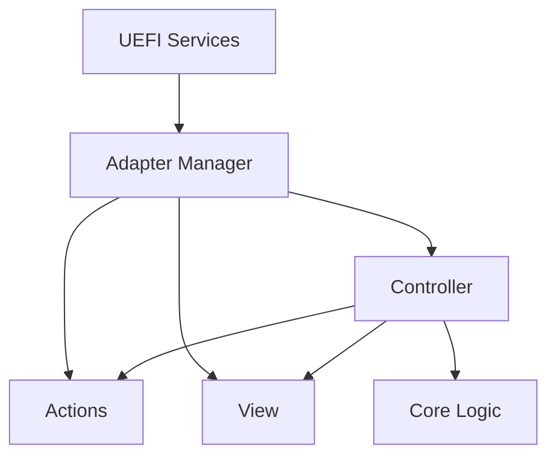

# Architecture

## Framework Overview

UefiNexus is a menu-driven platform diagnostics framework for UEFI environments.

The framework provides:

- Application lifecycle management
- Diagnostic page registration
- Menu-based navigation
- Diagnostic page execution

The current implementation includes a single diagnostic page:

- Memory Viewer (PageMem)

## High-Level Structure

```text
Application
├─ Page Registry
├─ Page Menu
└─ Diagnostic Pages
    └─ Memory Viewer (PageMem)
```

The `Application` provides the framework infrastructure.

- `Page Registry` maintains the list of available diagnostic pages.
- `Page Menu` allows users to select a diagnostic page.
- `Diagnostic Pages` implement platform inspection and diagnostic functionality.

## Runtime Flow

```text
UefiNexusMain
├─ AppInit
├─ AppRun
│  ├─ GetPageRegistry
│  ├─ PageMenu
│  ├─ Execute Selected Page
│  └─ Return to Menu
└─ AppDeinit
```

At runtime the application:

1. Initializes the console environment.
2. Loads the registered diagnostic pages.
3. Displays the page selection menu.
4. Executes the selected diagnostic page.
5. Returns to the menu when the page exits.
6. Restores the original console state during shutdown.

## Detailed Call Tree

```text
UefiNexusMain
├─ AppInit
│  ├─ validate gST / gST->ConOut
│  ├─ save CursorVisible
│  ├─ save Attribute
│  ├─ TuiClearScreen
│  └─ TuiEnableCursor(FALSE)
├─ AppRun
│  ├─ GetPageRegistry(&PageCount)
│  │  └─ returns static registry
│  │     └─ Memory -> PageMemLayered
│  └─ while (TRUE)
│     ├─ PageMenu(Pages, PageCount)
│     │  ├─ DrawMenu
│     │  ├─ TuiReadKey
│     │  ├─ handle UP/DOWN navigation
│     │  ├─ handle numeric selection
│     │  └─ handle ESC
│     └─ if selected page valid
│        └─ Pages[Sel].EntryPoint()
│           └─ PageMemLayered()
│              ├─ AdapterManagerInit(&Adapters)
│              └─ PageMemControllerRun(&Adapters)
│                 ├─ PageMemControllerInit(&PageState, Adapters)
│                 │  ├─ Adapters->Memory->Init()
│                 │  ├─ PageCoreInitAddressMap()
│                 │  ├─ PageCoreGetFirstValidAddress()
│                 │  └─ PageCoreInitPageState()
│                 └─ while (TRUE)
│                    ├─ if NeedsRedraw
│                    │  └─ PageMemViewDrawPage(...)
│                    ├─ Adapters->Tui->ReadKey()
│                    └─ PageMemControllerHandleKeyPress(...)
│                       ├─ cursor movement
│                       ├─ command actions
│                       └─ ESC -> page exit
└─ AppDeinit
   ├─ TuiEnableCursor(App->CursorVisible)
   ├─ TuiSetAttribute(App->Attribute)
   └─ TuiClearScreen
```

This call tree represents the current runtime architecture from application startup to the Memory Viewer interaction loop.

## Diagnostic Module Structure

The current reference implementation (PageMem) separates platform-specific functionality from diagnostic logic.



Responsibilities:

| Component | Responsibility |
| ---------- | ---------- |
| Entry | Initializes the diagnostic page and starts page execution |
| Adapter Manager | Acts as the bridge between diagnostic pages and UEFI services |
| Controller | Coordinates user input, page state, and runtime flow |
| Actions | Implements state-changing page operations |
| View | Renders page content and screen updates |
| Core Logic | Contains deterministic diagnostic and state-management logic without direct UEFI dependencies |

This organization separates diagnostic logic from platform-specific functionality.

The Adapter Manager acts as the boundary between diagnostic pages and UEFI services.

Controller, Actions, and View may access platform functionality through the Adapter Manager, while Core Logic remains independent of UEFI services.

PageMem demonstrates the recommended organization of a diagnostic page, but the framework does not currently enforce this structure.

## Dependency Constraints

PageMem Core does not depend on UEFI types or UEFI services.

PageMem Controller, View, and Actions interact with platform functionality through interfaces rather than directly invoking UEFI services.

This separation allows significant portions of the diagnostic implementation to be compiled and tested outside of UEFI environments.

The application shell and menu currently interact directly with UEFI and TuiLib services and are not part of the PageMem isolation model.

## Registration Constraints

Diagnostic pages are statically registered.

Page registration is implemented in PageRegistry.c through a static page descriptor table that maps menu titles to page entry functions.

To make a page available:

1. Add source files to UefiNexus.inf
2. Register the page in PageRegistry.c
3. Rebuild the firmware application

Current registry:

```text
Memory -> PageMemLayered
```

Current limitations:

- Static page registration
- No automatic page discovery
- No plugin mechanism