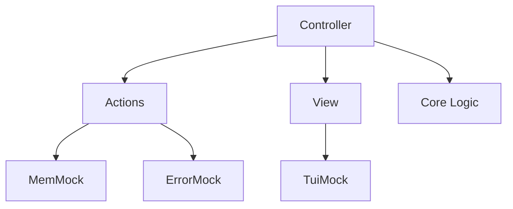

# Testing

The repository currently provides automated test coverage for the Memory Viewer (PageMem), which serves as the reference implementation for the framework's testing strategy.

Future diagnostic pages are expected to provide similar unit and integration test coverage.

## Core Unit Tests

Run:

```bash
./scripts/core-unit-test.sh
```

The script compiles and executes PageMem Core modules together with their unit tests.

Current coverage includes:

- AddressMap
- CursorEngine
- LayoutEngine
- FormatEngine
- StateMachine

These tests validate deterministic diagnostic logic in isolation and do not require UEFI services, console output, or adapter implementations.

## Mock-Based Integration Tests

Run:

```bash
./scripts/host-integration-test.sh
```

The integration tests compile PageMem components together with mock implementations of platform services.



The tests validate interactions between:

- Controller
- Actions
- View
- Core Logic
- Mock memory, UI, and error services

Mock services used during testing:

- MemMock
- TuiMock
- ErrorMock

By replacing UEFI-dependent services with mock implementations, PageMem behavior can be validated without booting into a UEFI environment.

These tests do not validate:

- Application startup and shutdown behavior
- Menu navigation and page dispatch
- Complete page execution flow
- Real UEFI adapter implementations

Firmware execution must still be validated separately through QEMU or physical hardware testing.

## Firmware Validation

Build and launch manually:

```bash
./scripts/build.sh x64
./scripts/qemu.sh x64
```

The scripts also support:

```bash
./scripts/build.sh arm
./scripts/qemu.sh arm
```

Firmware execution is currently validated manually through QEMU.

Physical hardware validation is also manual and is not part of the automated test workflow.

## Current Coverage

The repository currently provides automated testing for:

- PageMem Core logic
- PageMem Controller, Actions, and View interactions
- Mock-based memory, UI, and error service interactions

## Current Gaps

The repository does not currently provide automated testing for:

- Application startup and shutdown behavior
- Menu navigation and page selection
- Page registration
- Concrete UEFI adapter implementations
- Complete interactive page execution
- QEMU execution
- Physical hardware execution

## Guidance for New Pages

New diagnostic pages should:

- Add unit tests for Core logic
- Add integration tests for page behavior
- Validate functionality in QEMU when practical

PageMem serves as the current reference implementation for test organization and coverage strategy.